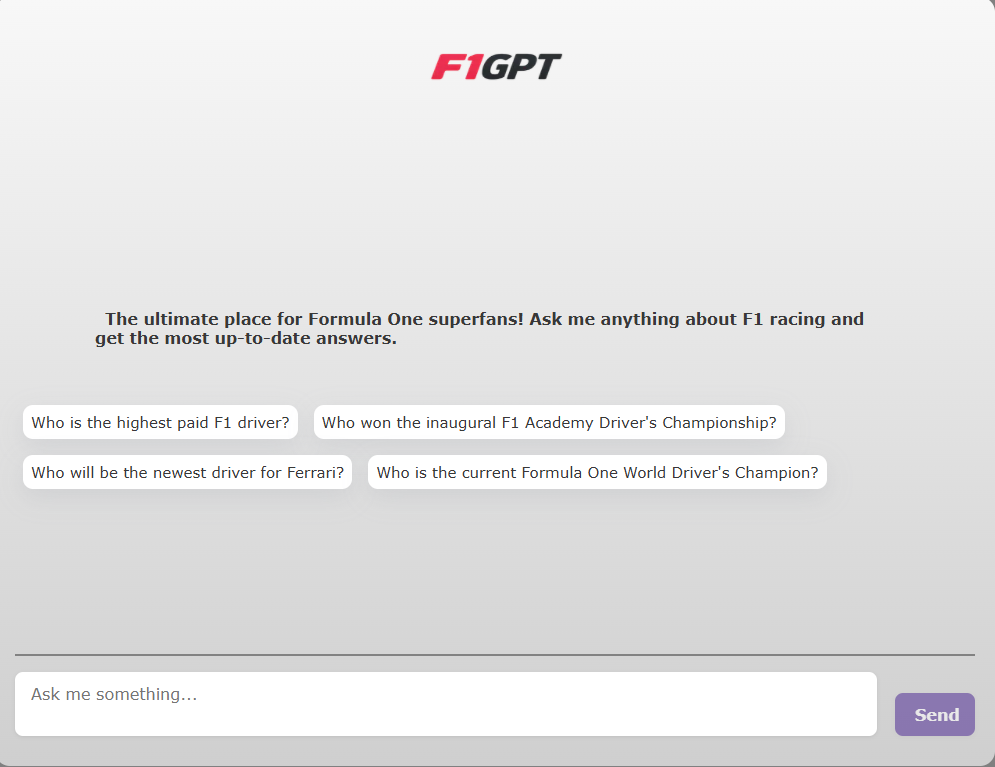
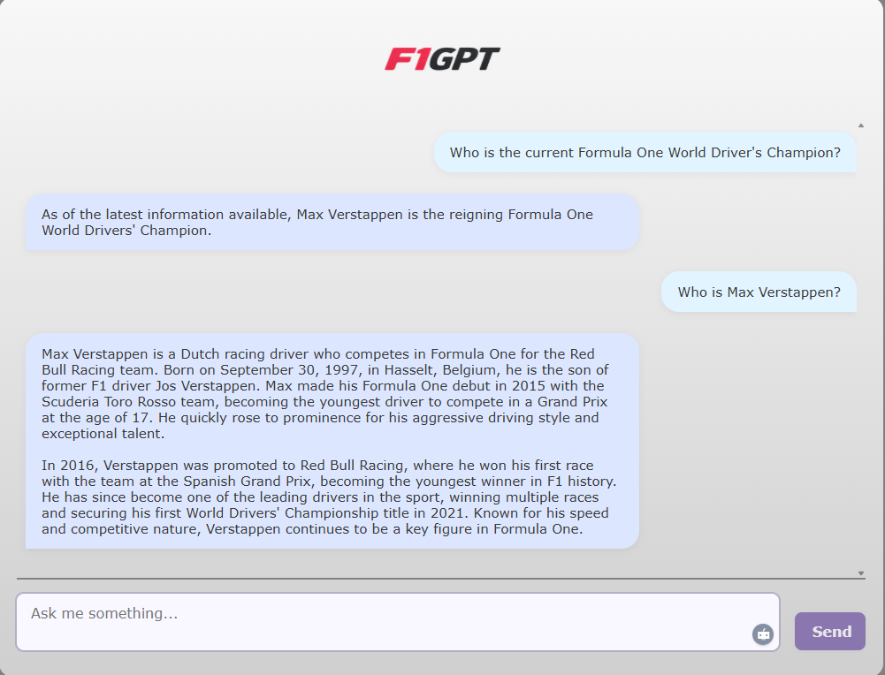

# F1GPT

## Description

F1GPT is a Formula One AI assistant built with Next.js, React, LangChain, and OpenAI. As a Retrieval-Augmented Generation (RAG) application, it delivers up-to-date, context-rich answers by combining vector-based retrieval with advanced LLM generation.

1. Data Ingestion (Retrieval): Scrapes official F1 sources and community sites (e.g., Wikipedia, Formula1.com, news outlets), splits content into manageable chunks, and generates embeddings using OpenAI.

2. Vector Storage (Augmentation): Stores embeddings in Datastax Astra DB and, at query time, fetches relevant chunks via vector similarity search with optional recency filtering.

3. Answer Generation: Feeds retrieved context into GPT-4o, which crafts comprehensive, natural-language responses in a real-time chat interface—without exposing internal data handling.

By uniting real-world Formula One data with powerful generative AI, F1GPT serves as the ultimate companion for fans seeking accurate, timely insights into the racing world.

## Table of Contents

* [Technologies Used](#technologies-used)
* [Requirements/Prerequisites](#requirementsprerequisites)
* [Installation](#installation)
* [Environment Variables](#environment-variables)
* [Data Loading](#data-loading)
* [Running the Development Server](#running-the-development-server)
* [Project Structure](#project-structure)
* [Usage](#usage)
* [Configuration](#configuration)
* [Contributing](#contributing)
* [License](#license)
* [Status and Roadmap](#status-and-roadmap)
* [Acknowledgments](#acknowledgments)

## Technologies Used

* **Next.js 13** (App Router, React Server Components)
* **React** and **TypeScript**
* **OpenAI** for embeddings and LLM API
* **LangChain** for text splitting and document loading
* **Datastax Astra DB** (DataAPIClient) for vector storage
* **Puppeteer** for web page scraping
* **@ai-sdk/react** for chat UI
* **dotenv** for environment configuration

## Requirements/Prerequisites

* Node.js >= 16.x
* npm or yarn
* ts-node (for TypeScript scripts)
* A Datastax Astra DB account and application token
* An OpenAI API key

## Installation

1. Clone the repository:

   ```bash
   git clone https://github.com/yourusername/f1gpt.git
   cd f1gpt
   ```

2. Install dependencies:

   ```bash
   npm install
   # or
   yarn install
   ```

3. Install ts-node (if not already installed):

   ```bash
   npm install -D ts-node typescript @types/node
   ```

## Environment Variables

Create a `.env.local` file in the root directory:

```env
ASTRA_DB_NAMESPACE=your_keyspace
ASTRA_DB_COLLECTION=your_collection
ASTRA_DB_API_ENDPOINT=https://your-db-id-astradb.apps.astra.datastax.com
ASTRA_DB_APPLICATION_TOKEN=your_application_token
OPENAI_API_KEY=your_openai_api_key
```

## Data Loading

The `loadDb.ts` script scrapes F1-related pages, splits text into chunks, generates embeddings, and upserts them into Astra DB.

```bash
npx ts-node loadDb.ts
```

## Running the Development Server

Start the Next.js development server:

```bash
npm run dev
# or
yarn dev
```

Open [http://localhost:3000](http://localhost:3000) in your browser.

## Project Structure

```
.
├── loadDb.ts            # Data ingestion & embedding loader
├── app
│   ├── api
│   │   └── chat/route.ts  # Chat API route with context retrieval
│   ├── assets
│   │   ├── Background.avif
│   │   └── F1GPT.png
│   ├── components
│   │   ├── Bubble.tsx
│   │   ├── LoadingBubble.tsx
│   │   ├── PromptSuggestionButton.tsx
│   │   └── PromptSuggestionsRow.tsx
│   ├── layout.tsx
│   └── page.tsx         # Main chat UI
├── .env.local
└── package.json
```

## Usage

-> Visit the UI to ask F1-related queries.

-> Use the prompt suggestions or type custom questions.

-> The system retrieves relevant context from Astra DB and generates answers via OpenAI.

### UI / Screenshots

Below is a preview of the F1GPT chat interface. You can capture your own screenshots and place them in an `assets/screenshots` folder, then update the paths accordingly.

![F1GPT Chat Interface]






## Usage

* Visit the UI to ask F1-related queries.
* Use the prompt suggestions or type custom questions.
* The system retrieves relevant context from Astra DB and generates answers via OpenAI.

## Configuration

* **Port**: Set `PORT` in your environment for a custom server port.
* **Similarity Metric**: Adjust the `SimilarityMetric` in `loadDb.ts` (`dot_product`, `cosine`, or `euclidean`).

## Contributing

Contributions are welcome! Please open an issue or pull request:

1. Fork the repo
2. Create your feature branch (`git checkout -b feature/YourFeature`)
3. Commit your changes (`git commit -m 'Add some feature'`)
4. Push to the branch (`git push origin feature/YourFeature`)
5. Open a pull request

## License

This project is licensed under the MIT License. See [LICENSE](LICENSE) for details.

## Status and Roadmap

* **Current Status**: Active development
* **Upcoming**:

  * Add user authentication
  * Improved error handling & retries
  * Docker & Kubernetes deployment
  * UI/UX enhancements

## Acknowledgments

* [OpenAI](https://openai.com)
* [Datastax Astra DB](https://astra.datastax.com)
* [LangChain](https://github.com/langchain-ai/langchain)
* [Next.js](https://nextjs.org)
* Thanks to the F1 community for inspiration!
